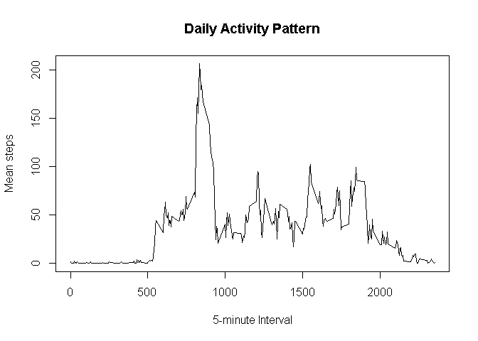
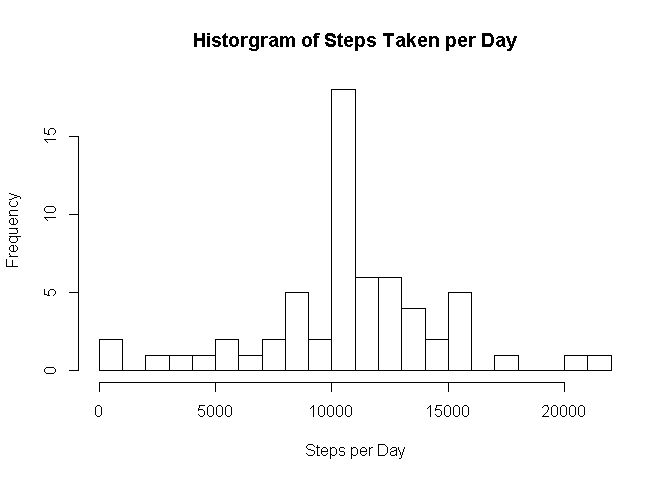
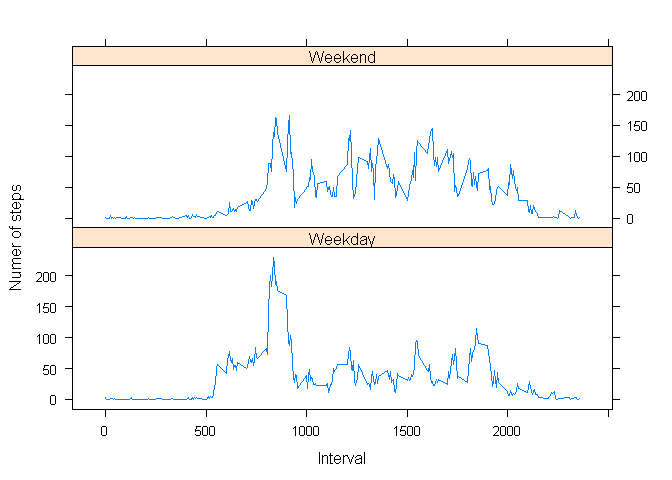

# Reproducible Research: Peer Assessment 1


## Loading and preprocessing the data

  Load the data that consists of two months of data from an anonymous individual collected during the months of October and November, 2012 and include the number of steps taken in 5 minute intervals each day.

```r
activity <- read.csv("./activity/activity.csv", header = TRUE)
activity[,2] <- as.Date(activity[,2])
```


## What is mean total number of steps taken per day?
   
   We calculate the total number of steps taken per day and create a histogram 

```r
stepsPerDay <- tapply(activity$steps, activity$date, sum)
hist(stepsPerDay, breaks = 25, main="Historgram of Steps Taken per Day", xlab="Steps per Day")
```

 

  The  mean and median of the total number of steps taken per day are  

```r
summary(stepsPerDay)[4:3]
```

```
##   Mean Median 
##  10770  10760
```


## What is the average daily activity pattern?

  The time series plot (i.e. type = "l") of the 5-minute interval (x-axis) and the average number of steps taken, averaged across all days (y-axis) is given by

```r
activityPerDay <- tapply(activity$steps, activity$interval, mean, na.rm=TRUE )
plot(row.names(activityPerDay), activityPerDay, type = "l", main="Daily Activity Pattern",
     xlab="5-minute Interval", ylab="Mean steps")
```

 

  The 5-minute interval that contains the maximum number of steps on average across all the days in the dataset is interval

```r
  names(which.max(activityPerDay))
```

```
## [1] "835"
```

## Imputing missing values

  The total numberof missing values in the dataset is

```r
summary(activity)[7]
```

```
## [1] "NA's   :2304  "
```

  Create a new data set with the missing values filled in using the mean of the 5 minute interval calculated earlier. If the values of the steps are missing, the corresponding mean steps for that interval is used.

```r
activity2 <- activity
activity2$steps <- ifelse(is.na(activity2$steps) & activity2$interval == names(activityPerDay),
                          activityPerDay, activity2$steps) 
```

  The  number of NA's in the new data set is now 

```r
sum(is.na(activity2))
```

```
## [1] 0
```

  The histogram for the total number of steps taken per day now becomes


```r
stepsPerDay2 <- tapply(activity2$steps, activity2$date, sum)
hist(stepsPerDay2, breaks = 25,main="Historgram of Steps Taken per Day", xlab="Steps per Day")
```

 


   Since the missing values are replaced with the mean for each 5-minute interval, the median has changed while the mean remains the same.  

```r
summary(stepsPerDay2)[4:3]
```

```
##   Mean Median 
##  10770  10770
```

## Are there differences in activity patterns between weekdays and weekends?
  Create a new factor variable in the dataset with two levels - "weekday" and "weekend" indicating whether a given date is a weekday or weekend day.

```r
activity2$day <- weekdays(activity2$date)
activity2$daytype <- ifelse(activity2$day == "Sunday" | activity2$day == "Saturday", "Weekend", "Weekday")
```

  Make a panel plot containing a time series plot (i.e. type = "l") of the 5-minute interval (x-axis) and the average number of steps taken, averaged across all weekday days or weekend days (y-axis).   


```r
activity2 <- aggregate(steps ~ interval + daytype, data = activity2, mean)
library(lattice)
xyplot(steps ~ interval | daytype,data=activity2, type= "l", layout = c(1,2), xlab="Interval", 
       ylab="Numer of steps")
```

 

  Based on the plot, the individual whom the data belongs to is more active during weekends than on weekdays.
